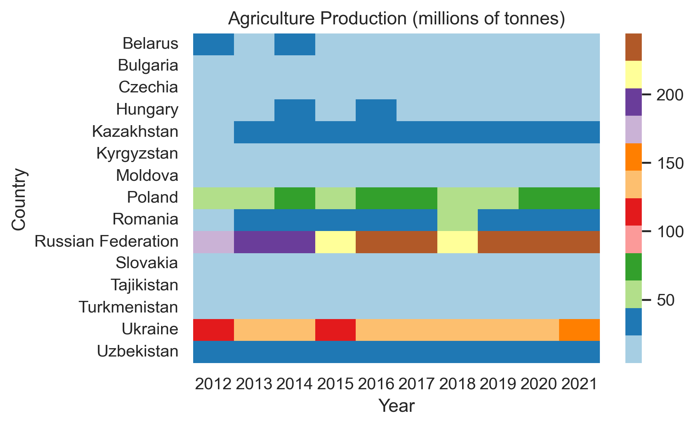

# AGRICULTURE-IN-EASTERN-EUROPE-AND-CENTRAL-ASIA
This project gives insights into the agricultural sector of Eastern Europe and Central Asian countries. Many international organizations group Eastern Europe and Central Asian countries together because they are developing countries that have geographic proximity and similar challenges.

The main purpose of the projecc is to see main agricultural products, to estimate the relationship between employment rate in agriculture sector and its production in each country. 

# SUMMARY
Eastern Europe and Central Asia includes 15 countries, 9 of them are post-soviet countries. The list of countries: Belarus, Bulgaria, Czechia, Hungary, Kazakhstan, Kyrgyzstan, Poland, Moldova, Romania, Russian Federation, Slovakia, Tajikistan, Turkmenistan, Ukraine, Uzbekistan. Grouping of these countries to Eastern Europe and Central Asia is made in datasets of FAOSTAT (Food and Agriculture Organization). 

For the analysis, data were collected on production, export, and the employment rate in the agricultural sector for each country of the region. Comparative, descriptive, correlational, and retrospective analyzes were carried out based on data from FAOSTAT and World Bank.

# INPUT DATA
There are three csv files and one folder for shapefiles:
1. **FAOSTAT_data_en_production_01_21.csv**, which has detailed information on crops and livestock production quantity of each country of the region for period between 2001-2021.
2.  **FAOSTAT_data_en_export_01_21.csv** - data on crops and livestok export quantity of each country of the region for period between 2001-2021.
3.  **API_SL.AGR.EMPL.ZS_DS2_employment.csv** - data on employment rates in agricultural sector of all countries in the world for period between 1991-2019. This data is from World Bank. 
4. **Shapefiles** folder that contains shapefiles for each country of the region to map analysis results through QGIS. 

During analysis data is cleaned up to the required variables for the project purpose.

# ANALYSIS
Analysis is done in 5 Python scripts, and  some results of the analysis were mapped through QGIS. Scripts may consist runcells that are called parts in this project for the convenience. 

## I. Script 1_production.py
This script is designed to analyze the agricultural production of the countries of the region. The content of the script is conventionally divided into three parts using the `#%%` sign. These parts of the script need to be run in order to avoid overlapping graphs.

1. First, script reads the input data from FAOSTAT on the production of the countries for 2001-2021. Then the data is cleaned up to the necessary variables for analysis. After production data is grouped by countries and years, it was reshaped so that each row represents a country and each column represents a year.  After that, script builds a heatmap on total agriculture production by country and year choosing period 2012-2021 years. The heatmap is saved as png file named `agriculture_production.png`. 

2. Second part of the script is focused on wheat production of the countries. It begins with filtering out the data on wheat production from total agriculture production data. Further, the script cleans up the data and groups it by countries and years in a similar way. Then, it constructs second heatmap that is on wheat production quantities in millions of tons by country and year for the same period. The heatmap is saved as `wheat_production.png`.

3. Third, the script joins the grouped data on total production and wheat production saving it as csv file called `total_data_EECA.csv`. EECA abbreviation in the name of the file means Eastern Europe and Central Asia. 

## II. Script 2_export.py
Second script aims to analyze agricultural export data of the countries. This script also has 3 conventional parts that are divided by the `#%%` sign.

1. Firstly, the script reads the FAOSTAT data on export of crops and livestock production of Eastern Europe and Central Asian countries for 2001-2021 period. After that, it cleans up the data to necessary variables. Then, it groups the data by country and year to build linegraph of total agricultural export quantities for each country between 2001-2021. The graph is saved as png file called `total_export.png`.

2. Secondly, the script filters out the data on wheat export, and groups it by country and year. Further, it builds linegraph of wheat exports by country between 2001-2021 and saves the graph as `wheat_export.png` file. 

3. Finally, `total_data_EECA.csv` file updated with the data on total export and wheat export that was gained as a result of this script. 

## III. Script 3_the_most.py
Third script analyzes the most produced product and the most exported product by country using the data information for 2021 year. The script contains 5 parts to be run that are divided between each other by `#%%` sign.

1. First part of the script starts from reading merged `total_data_EECA.csv` data and selecting up its infromation only for 2021 since it is needed for further estimation of shares of the most produced and exported items. Then, it reads FAOSTAT data on detailed production 2001-2021 to select detailed production data for 2021. After selecting, the data is grouped by country and product to find the most produced product by each country. To be clear, the script then evaluates percentage of the most produced product in the total production by each country in 2021. These indicators plotted as a histogram and saved to `prct_prod_most.png` file.  

2. Next part of the script is designed to group countries with the same type of the most produced product and display them with their values using for loop with print functions inside. 

3. Thirdly, the script reads the detailed data on agricultural export for 2001-2021 so that it selects up data for 2021. Further, it groups the selected data by country and product to define the most exported product by each country. After that, it estimates percentage of the most exported product in total agricultural export of each country to plot a histogram. The histogram is saved in `prct_export_most.png` file. 

4. Furthermore, it groups the countries with the same type of the most exported product and reports their values using for loop by the analogical way. 

5. Finally, the script merges the data on the most exported product onto the data on the most produced product by each country in 2021. After the merging, the data is saved to file called `the_most_data_2021.csv`.

## IV. Script 4_employment.py
Fourth script is intended to analyze the employment rate in agricultural sector of the countries and estimate how the employment rate is related to agriculture production by country. The script is built by 4 parts that are divided with  `#%%` sign. 

1. To begin with, the script reads World Bank data on the employment rate in agricultural sector. But this data consists of infromation for all countries of the world since 1991 to 2019. So, the script then selects up the necessary countries and corresponding years for analysis. As a result, the employment data for Eastern Europe and Central Asian countries between 2001-2019 is saved to csv file called `employment_data.csv`. 

2. Next small part of the script reads the data `total_data_EECA.csv` constructed in previous scripts and selects up necessary variables from this data for further correlation analysis. 

3. Following part of the script drops an unnecessary column from employment dataframe and restructures it from wide to long format by using melt function of Pandas. After that, it plots agricultural employment rate for each country between 2001-2019 as linegraph and saves it as `employment_rates.png`.

4. Lastly, the script merges employment data onto total agricultural production data on country and year. Further, it groups the merged data by country, and calculates the correlation coeffitients between agriculture production and employment rate for each country. The script ends with displaying correlations and saving scatter plots with linear regression line for each country where years are points on scatter plots. 15 scatter plots on correlation are saved as 15 png files. 

## V. Script 5_maps.py
Fifth script is not divided into parts and contains the geodata of the countries of the region. It reads the polygon of each country, standardize column names, and joins them to one shapefile for the region that is used for mapping some analysis results in QGIS. The shapefile for the region is saved as `REGION.shp`.

## VI. Maps 'region_map.png' and 'the_most_prod_map.png'
This secttion is made in QGIS application by using shapefiles for countries of the region. Shapefiles were downloaded separately from two sources: OCHA the Humanitarian Data Exchange and Geospatial Data of University of Texas at Austin. 

1. First, each country's shapefile opened as layer in QGIS and created a group of layers that display whole map of the region where countries colored differently. Then each country is labeled with its name, and the map is projected with appropriate coordinate reference system so that Russian Federation's territory is not divided into two parts. Then, it saves the map of the region with countries' names as `region_map.png`. Also the group of layers is saved as `region_map.qgz` file.

2. Second, QGIS opens the shapefile 'REGION.shp' that was created as a result of fifth script by using GeoPandas Python. Then, it opens the data on the most produced and exported products that were saved to  `the_most_data_2021.csv`. It joins the csv file to the map layer. After joining them, it labels every country by its name, name of the most produced product, and its value in millions of tons. Further, to see the difference in production amounts, it classifies countries by the product's quantity in pretty breaks and  marks them from light to dark colors where the darker color is for higher quantity. And, it saves the results as `the_most_prod_map.png`. The layers are saved as `the_most_prod_map.qgz`. 

# RESULTS
The analysis results in 3 csv files, 2 qgz files, 9 png files for the region, and 15 png files on correlation analysis for 15 countries.  

## Heatmaps on agriculture production

***agriculture_production.png***
 
Accoridng to heatmap `agriculture_production.png`, Russian federation is the most producer country of agriculture production in the region between 2012-2021 producing on average about 200 millions of tons per year. Then goes Ukraine with the second most agriculture production. Poland closes the top three. Next biggest countries outside of top three are Romania, Kazakhstan, and Uzbekistan. Others have average yearly production no more than 10-15 mln tons. 

Next heatmap `wheat_production.png` shows almost the similar tendency to total production where Russia and Ukraine are the biggest producers of wheat in corresponding order. But the third country in wheat production is now Kazakhstan instead of Poland which was the third for total production. Then Poland and Romania as the next significant wheat producers of the region. 

## Linegraphs on agriculture export
Linegraphs in `total_export.png` shows dymanics of agriculture production export by country between 2001-2021. As the graph displays all countries had almost similar export no more than 10 mln tons in 2001, but then Ukraine and Russia started to increase export quantities significantly comparing to others. Ukraine overtakes Russia in export. Next relatively bigger exporters are Poland, Romania, Hungary, and Kazakhstan. One interesting thing in this graph is that Uzbekistan had extremely sharp jump in 2015 reaching almost Russian export quantity but then dropped sharply in 2017. 

`Wheat_export.png` demonstrates dynamics of wheat export by countries between 2001-2021. Russia is the first exporter here, then goes Ukraine. Russia goes down in recent years while Ukraine has gradual increase. Next significant wheat exporters after them are Romania, Bulgaria, and Kazakhstan. 

## Total data on production and export
All this data on production and export of EECA (Eastern Europe and Central Asia) countries is saved to a csv file called `total_data_EECA.csv`. 

## Histograms of the most produced and the most exported product
`prct_prod_most.png` file shows percentage of the most produced product in agriculture production by each country of the region for 2021. As the histogram displays the countries can be grouped by 4 types of the most produced products. Wheat is the most produced product for 7 countries of the region. Maize corn is the most produced product for 4 countries. Potatoes are for 3 countries, while Sugar beet is the most produced product for only Poland. 

`prct_export_most.png` file demonstrates the percentage of the most exported product in agriculture export by each country of the region for 2021. The interesting thing is that some countries have other product as the most exported than the most produced product. For example, Belarus has the most export of crude canola oil while its the most produced product is potatoes. Poland exports more wheat than sugar beet. And two maize corn countries Moldova and Romania have wheat as the most exported product. 

## Data on the most produced and exported products
The data used for graphing the most produced and exported products is from csv file called `the_most_data_2021.csv`. This file is created as a result of 3-script - `3_the_most.py`. 

## Employment rate
`employment_rates.png` file consists of dynamics of the employment rate in agriculture sector of each country for 2001-2019. from this graph it is obvious that in which countries agriculture plays main role as people's income source. Tajikistan has the highest employment rate in agriculture for all time among others of the region. As in Tajikistan, in the beginnig of 2000-s Molodva and Romania also had more than 50% employment rate in agriculture. Then they have decreasing of tis rate to the less than 25%. Generally, all countries have a declining tendency in this indicator that might be related to global urbanization process. For 2019, which is the last year in the employment data, Uzbekistan has the second largest employment rate in agriculture. 

## Data on employment rates
The data used for the employment rate graph is from `employment_data.csv` file that is the result of analysis in script `4_employment.py`. 

## Correlations between employment rate and agriculture production
15 png files that consist of scater plots and regression lines for ech country's agriculture epmloyment rate with griculture production. Countries can be grouped to 3 groups: with strong negative correlation, with weak negative correlation, and with positive correlation. Points in scatter plot are years that are between 2001-2019. 

There are 7 countries that have strong negative correlation between agriculture employment rate and agriculture production. These countries are Uzbekistan, Ukraine, Kazakhstan, Kyrgyzstan, Russia, Tajikistan, and Belarus. All of them are post-soviet countries. They had high employment rate and low production in the beginning of 2000-s, and these indicators have been changing during time to opposite direction. So, employment rates get lower while production increases. It might be related to intensive implementation of technologies in agriculture that substitute human labor. It needs more research to identify the exact reasons for each country. 

There are 6 countries that have weak negative correlation between employment rate and production. They are Romania, Slovakia, Czechia, Bulgaria, Hungary, Moldova. Changes in employment rates didn't affect significantly to production amounts.  They have slight increase in production with decreasing employment rate in agriculture. But, Hungary has very weak correlation that can be identified as no correlation between employment rate and production. 

The interesting thing is that there are 2 countries with positive correlation - Poland and Turkmenistan. But Turkmenistan has clear positive correlation between employment rate and production in agriculture sector. It might mean that Turkmenistan's agriculture sector is still more dependent on human labor than technology. Poland's correlation is very weak as Hungary's, and seems it doesn't show any notciable correlation. 

## Maps
There are two maps: `region_map.png` and `the_most_prod_map.png`. 
1. First map `region_map.png` just shows territories of each country of the region to understand their land size. Land size is an important factor for agriculture. As it can be seen from map Russian Federation has a huge territory that is a consiquent cause of the biggest agriculture production. 
2. Second map `the_most_prod_map.png` displays the most produced product of each country with its value in millions of tons. According to this map, Russia is the biggest producer of wheat in the region. Ukraine is the biggest producer of maize corn.  The biggest producer in potatoes production is Belarus. And, Poland is the first in sugar beet production. Others have also one of these products as the most produced product but in less quantities than above mentioned countries. QGZ files of these maps that contain project files created by QGIS are also located to the repository: `region_map.qgz` and `the_most_prod_map.qgz`.

# LINKS TO DATA SOURCES
Data on production from FAOSTAT: https://www.fao.org/faostat/en/#data/QCL 

Data on export from FAOSTAT: https://www.fao.org/faostat/en/#data/TCL 

Data on employment rate from World Bank: https://data.worldbank.org/indicator/SL.AGR.EMPL.ZS 

Shapefiles from two sources: 
1) OCHA the Humanitarian Data Exchange: https://data.humdata.org; 
2) geospatial data of UT Austin:  https://geodata.lib.utexas.edu